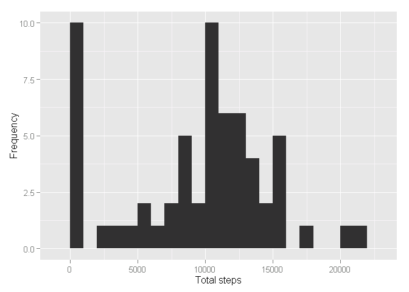
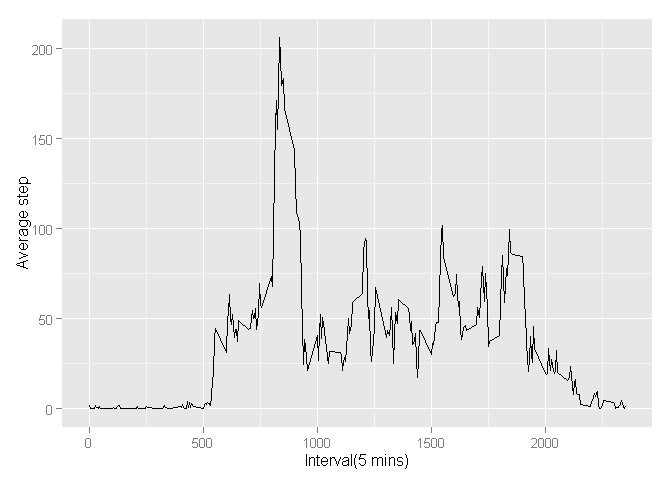
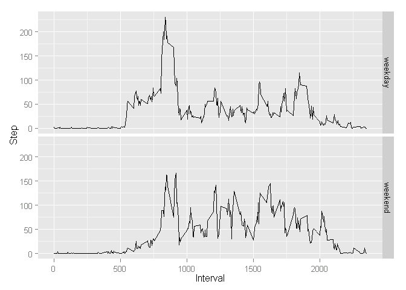

# Reproducible Research: Peer Assessment 1

## Loading and preprocessing the data

```r
library(knitr)
```

```
## Warning: package 'knitr' was built under R version 3.1.2
```

```r
library(ggplot2)
#load the knitr library

activity <- read.csv("activity.csv")
#read file
```

## What is mean total number of steps taken per day?


```r
step <- tapply(activity[,1], activity[,2], sum, na.rm=TRUE)
#calculate the total steps based on each date

qplot(step, xlab='Total steps', ylab='Frequency', binwidth = 1000)
```

 

```r
#draw a diagram

mean(step, na.rm=TRUE)
```

```
## [1] 9354.23
```

```r
median(step, na.rm=TRUE)
```

```
## [1] 10395
```

```r
#the mean and the median of the total steps taken per day
```

## What is the average daily activity pattern?


```r
aggdata <- aggregate(x=list(activity[,1]), by=list(activity[,3]), FUN=mean, na.rm=TRUE)
#aggregrate the steps based on intevals
#reference of aggregrate(): http://www.statmethods.net/management/aggregate.html

colnames(aggdata) <- c("inteval", "step")
#assign column names

ggplot(aggdata, aes(x=aggdata[,1], y=aggdata[,2])) + geom_line() + xlab("Interval(5 mins)") + ylab("Average step")
```

 

```r
#draw a diagram

aggdata[which.max(aggdata[,2]),]
```

```
##     inteval     step
## 104     835 206.1698
```

```r
#find the interval with maximum number of steps
```

The interval with maximum number of steps is 835.

## Imputing missing values

In order to change the NAs with some value, I decide to borrow the steps of 5 mins intervals from the previous question, and fill the NAs with value based on the relative interval.


```r
nas <- is.na(activity[,1])
#mark all rows with NAs

sum(nas)
```

```
## [1] 2304
```

```r
#calculate the sum of NAs

activity2 <- activity
#create a new activity dataset

for (i in 1:nrow(activity2)){
  if(is.na(activity2[i,1])){
    inteval <- activity2[i,3]
    activity2[i,1] <- aggdata[aggdata[,1] == inteval, 2]
  }
}
#verify if the step of a row is NA
#change the value of NAs with the value within the same interval(which we found in the question 2 above)

step2 <- tapply(activity2[,1], activity2[,2], sum, na.rm=TRUE)
#calculate the total steps based on each date

mean(step2)
```

```
## [1] 10766.19
```

```r
median(step2)
```

```
## [1] 10766.19
```

```r
#the mean and the median of the total steps taken per day
```

The value of mean and median are both higher because the NAs are replaced with some actual value which must >=0.

## Are there differences in activity patterns between weekdays and weekends?

In this part I created a function "is.weekend" to verify if a date belong to weekend or not. 

Please note that in the function I use two strings "星期日", "星期六", which can be refered to Sunday and Saturday in English. This is because the default language of my system is Chinese, and I'm too tired to adjust the setting...


```r
is.weekend <- function(date) {
  if (weekdays(date) %in% c("星期日", "星期六"))
    return("weekend")
  else
    return("weekday")
}
#A function to verify weather the target date is weekend
#the chinese words"星期日" and "星期六" means Sunday and Saturday
#because my R default language is chinese so it need to be setup like this

activity2[,2] <-as.Date(activity2[,2], format = "%Y-%m-%d")
#transform the date format

activity2$isweekend <- sapply(activity2[,2], is.weekend)
#add a new column and werify if the date is weekend

aggdata <- aggregate(steps ~ interval + isweekend, data=activity2, mean)
#aggregate the new data based on the 5 mins interval

ggplot(aggdata, aes(interval, steps)) + geom_line() + facet_grid(isweekend ~ .) +
  xlab("Interval") + ylab("Step")
```

 

```r
#draw diagrams of weekend and weekday
```
